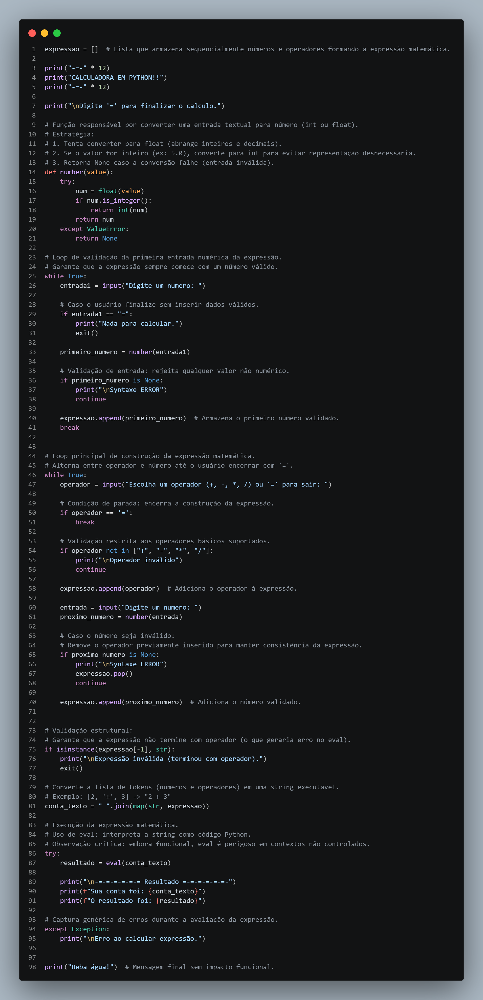

# 🧮 Calculadora em Python



## 📌 Sobre o Projeto

Este projeto consiste em uma calculadora desenvolvida em Python com foco em **lógica de programação, validação de entrada e manipulação de expressões matemáticas**.

O objetivo principal não é apenas realizar cálculos simples, mas servir como base evolutiva para construção de um **interpretador matemático mais robusto**, permitindo crescimento contínuo do projeto.

---

## 🚀 Funcionalidades Atuais

* Entrada interativa via terminal
* Suporte às quatro operações básicas:

  * Soma (+)
  * Subtração (-)
  * Multiplicação (*)
  * Divisão (/)
* Validação de entrada do usuário
* Conversão automática entre `int` e `float`
* Prevenção de expressões inválidas
* Construção dinâmica da expressão antes da execução

---

## ⚙️ Como Funciona

O sistema segue um fluxo estruturado:

1. O usuário insere um número inicial válido
2. Escolhe um operador matemático
3. Insere o próximo número
4. O processo se repete até o usuário finalizar com `=`
5. A expressão é montada como string
6. O cálculo é realizado

---

## 🧠 Conceitos Aplicados

Este projeto explora fundamentos importantes como:

* Tipagem dinâmica em Python
* Tratamento de exceções (`try/except`)
* Validação de dados
* Estruturas de repetição (`while`)
* Manipulação de listas
* Conversão de tipos
* Execução dinâmica de expressões

---

## ⚠️ Limitações Atuais

Apesar de funcional, o projeto possui limitações importantes:

* Uso de `eval()` para cálculo (não recomendado em produção)
* Não suporta precedência de operadores (ordem matemática correta)
* Não suporta parênteses
* Arquitetura ainda não modularizada

---

## 🔥 Roadmap (Evolução do Projeto)

Este projeto está em constante evolução. As próximas melhorias incluem:

### 🔹 Curto Prazo

* Remoção do uso de `eval()`
* Implementação de cálculo manual (sem execução dinâmica)
* Melhor organização do código

### 🔹 Médio Prazo

* Suporte à precedência de operadores
* Implementação de pilhas (stack)
* Separação em módulos (parser, evaluator, interface)

### 🔹 Longo Prazo

* Implementação de parser completo de expressões
* Suporte a parênteses
* Possível interface gráfica (GUI)
* Transformação em mini linguagem matemática

---

## 🏗️ Estrutura Atual

```bash
.
├── calculator.py
└── README.md
```

---

## ▶️ Como Executar

```bash
python calculator.py
```

---

## 💡 Objetivo Profissional

Este projeto não é apenas uma calculadora simples.

Ele foi pensado como um **projeto incremental**, onde cada melhoria representa um avanço em:

* Estrutura de software
* Pensamento algorítmico
* Capacidade de resolver problemas reais

---

## 📈 Status do Projeto

🚧 Em desenvolvimento contínuo

---

## 🤝 Contribuições

Sugestões, melhorias e críticas são bem-vindas.

---

## 📜 Licença

Este projeto está sob a licença MIT.

---

## ⚡ Nota Final

Este projeto começa simples por design, mas a intenção é evoluir para algo significativamente mais sofisticado.

Se você está acompanhando esse repositório, espere mudanças frequentes, refatorações agressivas e melhorias estruturais ao longo do tempo.
